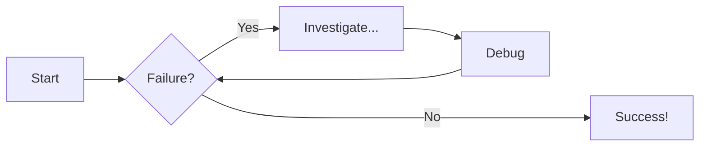
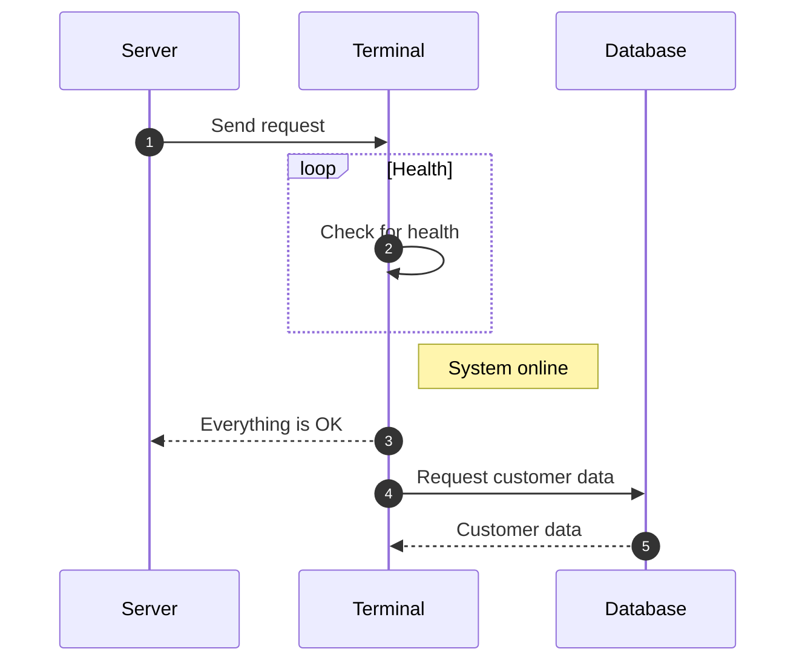

# Welcome to MkDocs

For full documentation visit [mkdocs.org](https://www.mkdocs.org).

## Commands

* `mkdocs new [dir-name]` - Create a new project.
* `mkdocs serve` - Start the live-reloading docs server.
* `mkdocs build` - Build the documentation site.
* `mkdocs -h` - Print help message and exit.

## Project layout

    mkdocs.yml    # The configuration file.
    docs/
        index.md  # The documentation homepage.
        ...       # Other markdown pages, images and other files.

## Code

=== "Python"

    ```py title="add_numbers.py" linenums="1" hl_lines="2-3"
    # Function to add two numbers
    def add_two_numbers(num1, num2):
        return num1 + num2

    # Example usage
    result = add_two_numbers(5, 3)
    print('The sum is:', result)
    ```

=== "JavaScript"

    ```js title="add_numbers.js" linenums="1" hl_lines="2-4"
    // Function to add two numbers
    function add_two_numbers(num1, num2) {
        return num1 + num2;
    }

    // Example usage
    const result = add_two_numbers(5, 3);
    console.log("The sum is:", result);
    ```

## Admonitions

!!! note "Title of the callout"

    Lorem ipsum dolor sit amet, consectetur adipiscing elit. Nulla et euismod
    nulla. Curabitur feugiat, tortor non consequat finibus, justo purus auctor
    massa, nec semper lorem quam in massa.

??? info "Collapsible callout"

    Lorem ipsum dolor sit amet, consectetur adipiscing elit. Nulla et euismod
    nulla. Curabitur feugiat, tortor non consequat finibus, justo purus auctor
    massa, nec semper lorem quam in massa.

## Diagrams

## Flowchart



## Sequence diagram

